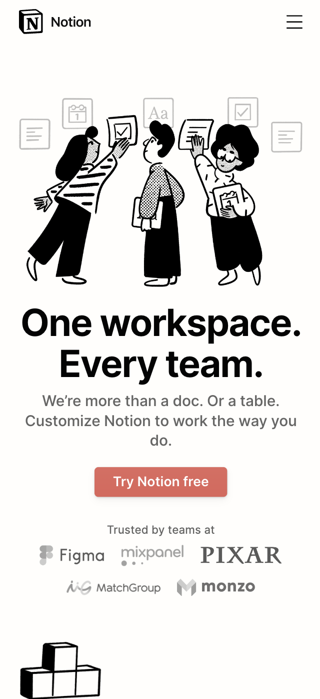
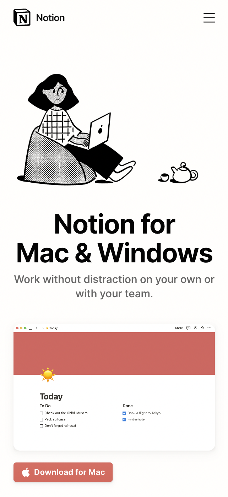
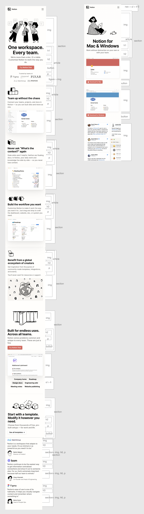
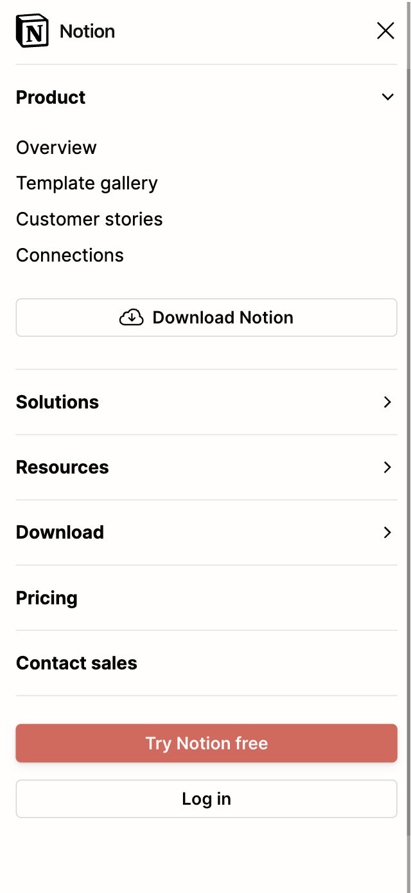
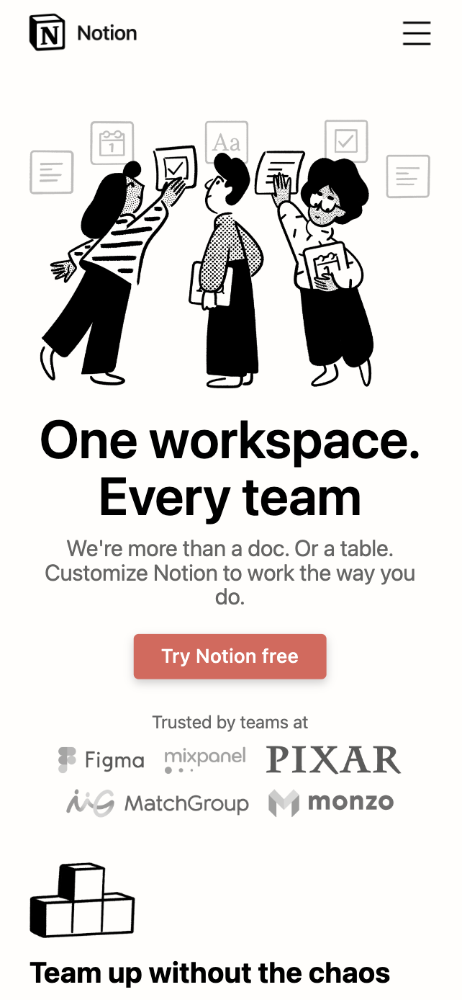
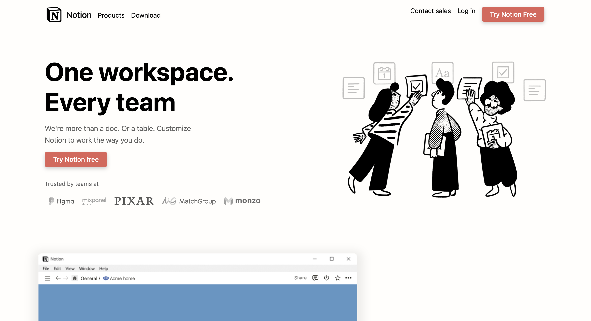
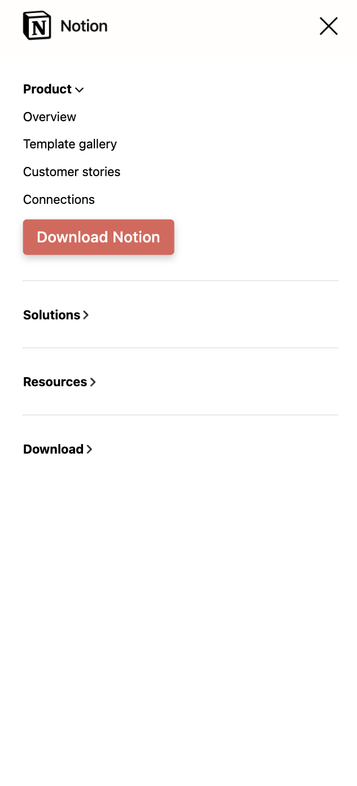
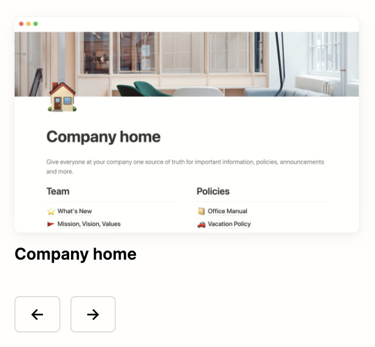

# Procesverslag
Markdown is een simpele manier om HTML te schrijven.  
Markdown cheat cheet: [Hulp bij het schrijven van Markdown](https://github.com/adam-p/markdown-here/wiki/Markdown-Cheatsheet).

Nb. De standaardstructuur en de spartaanse opmaak van de README.md zijn helemaal prima. Het gaat om de inhoud van je procesverslag. Besteedt de tijd voor pracht en praal aan je website.

Nb. Door *open* toe te voegen aan een *details* element kun je deze standaard open zetten. Fijn om dat steeds voor de relevante stuk(ken) te doen.

## Jij

  
uitwerken voor kick-off werkgroep

### Auteur:

Rose Mulazada

#### Je startniveau:

Rode piste

#### Je focus:

Responsive (eerst surface)

## Je website

  
uitwerken voor kick-off werkgroep

  ### Je opdracht:
  www.notion.so/

  #### Screenshot(s) van de eerste pagina (small screen): 
  Home  
 

  #### Screenshot(s) van de tweede pagina (small screen):
  Download for Mac & Windows

 

## Toegankelijkheidstest 1/2 (week 1)

  
uitwerken na test in 1e werkgroep

  ### Bevindingen
  Lijst met je bevindingen die in de test naar voren kwamen:

  #### Screenreader
  Ik merkte gelijk dat sommige afbeeldingen niet worden opgelezen door de screenreader. Niet vanzelf, en ook niet met muis en toetsenbord. Ik heb er gelijk dus een puntje van gemaakt om ervoor te zorgen dat dit bij mij wel kan. Het blijkt dat er geen alt tekst staat bij de afbeeldingen en dat de rede is dat dit niet gebeurt. De website was voor de rest prima te navigeren.

  #### Muis en Toetsenbord 
  Hier korte omschrijving (met indien nodig afbeeldingen)
Zoals ik al heb gezegd werden foto's ook niet opgelezen met een muis en toetsenbord. Ook als ik erop probeerde te klikken deed dit niks. Ook worden de foto's voorgelezen voor de tekst wat niet heel fijn is voor mensen met een beperking. Belangrijke foto's worden ook niet opgelezen, denk bijvoorbeeld aan de 'trusted by' sectie waar er logo's staan van bedrijven die Notion gebruiken. Maar het wordt niet opgelezen.

  #### Overig

De motoriek en visuele testen hadden we deze week niet gedaan.

## Breakdownschets (week 1)

  
uitwerken na afloop 2e werkgroep

  ### de hele pagina: 
  

  ### dynamisch deel (bijv menu): 
  

## Voortgang 1 (week 2)

  
uitwerken voor 1e voortgang

  ### Stand van zaken
  hier dit ging goed & dit was lastig (neem ook screenshots op van delen van je website en code)

  ### Agenda voor meeting
  samen met je groepje opstellen

We hadden eigenlijk niet heel specifieke punten die we wilden behandelen tijdens deze meeting, dus hebben we in de tabel vooral staan dat we vragen hadden over hoe we bepaalde dingen konden aanpakken.

  ### Verslag van meeting
  hier na afloop snel de uitkomsten van de meeting vastleggen

  - Ik had wat moeite met de navigatie bar: het bleek eerst alsof je er niet doorheen kon met een screenreader op de standaard website. Hij opent het ook niet zelf, wat eigenlijk wel goed is. Maar ik kwam er toen achter hoe ik het kon openen, ik begreep de screenreader niet helemaal.
- Ik had verder niet heel veel vragen - het ging vooral over mijn figure, ik kreeg hem niet zoals de website omdat elke foto een andere grootte hadden.

## Voortgang 2 (week 3)

  
uitwerken voor 2e voortgang

  ### Stand van zaken
  hier dit ging goed & dit was lastig (neem ook screenshots op van delen van je website en code)

  ### Agenda voor meeting
  samen met je groepje opstellen

Bij deze les hadden we het anders aangepakt - we hadden niet meer gesprekken per groepjes maar gewoon een normale les waarbij we naar de studentassisten toe konden als we hen nodig hadden. Ik had eigenlijk niet veel vragen en dit kwam vooral omdat ik had besloten om te wisselen van surface naar responsive, oftewel ik moest opnieuw beginnen..

  ### Verslag van meeting
  - Uiteindelijk toen ik verder kwam met mijn website kwam ik bij een aantal delen met Javascript. Ik heb toen aan de docent gevraagd hoe het hiermee zat, en hij vertelde me onderanderen dat ik hidden attributes en on scroll kan gebruiken.

## Toegankelijkheidstest 2/2 (week 4)

  
uitwerken na test in 8e werkgroep

  ### Bevindingen
  Ik was vooral bezig met ervoor zorgen dat alle images als laatst gelezen werden met de screenreader. Ook hield ik rekening dat het mogelijk was om door de website heen te gaan met een screenreader.

  #### Screenreader
  Ik had hier nog een keer gekeken naar het menu en de afbeeldingen. Ik dacht eerst dat het menu niet opgelezen kon worden, maar blijkbaar wist ik gewoon niet hoe ik de screenreader juist moest gebruiken.. maar het probleem met de foto's bleef hetzelde. Ik kon verder niets meer vinden.

  #### Muis en Toetsenbord 
  Hier had ik ook niet meer gevonden. 

  #### Motoriek (shocks, elastiekjes)
  Het was best lastig om bij het hamburgermenu te komen, maar dat was alsnog te doen. Omdat er niet veel content om mijn pagina's waren om mee te interacteren was er ook niet heel veel bruikbaars dat ik kon veranderen.

  #### Visueel (brillen, contrast, kleurenblind, dark/light). 
  Mijn website heeft over het algemeen best wel een hoog contrast en weinig kleuren (grijs, wit, zwart, salmon). Alleen de grijze tekst kan lastig te lezen zijn als je contrast lastig kunt zien.

## Voortgang 3 (week 4)

  
uitwerken voor 3e voortgang

  ### Stand van zaken
  In deze les liet ik zien dat ik veel verder was in mijn responsive en ik begon het echt te snappen. Ik zat alleen teveel aan de details waardoor ik best traag was en achterviel.

  ### Agenda voor meeting
  Eigenlijk wou ik in deze les vooral zelfstandig aan de slag en vragen stellen waar nodig.

  ### Verslag van meeting
  hier na afloop snel de uitkomsten van de meeting vastleggen

  - De docent kwam langs en vroeg of ik hulp nodig had. Ik vroeg toen over een onderdeel van de website met javascript (dat ik uiteindelijk niet heb gemaakt) en of dat telde als een micro-interactie. Hij telde wel maar het hamburgermenu telt ook, dus heb ik die uiteindelijk gemaakt, vooral ook omdat het belangrijker was.

## Eindgesprek (week 5)

  
uitwerken voor eindgesprek

  ### Je uitkomst - karakteristiek screenshots:
  

  ### Dit ging goed/Heb ik geleerd: 
  Korte omschrijving met plaatjes

  
  Vooral responsive ging goed, en daarbij bedoel ik vooral hoe de tekst boven de grote afbeelding komt te staan in de mobile versie. Ik heb tijdens dit vak responsive onder de knie gekregen met flexbox waar ik eigenlijk in de eerste instantie niks van begreep.
  
  Verder ben ik ook trots op de overgang van een 'normaal' desktop menu naar het hamburgermenu en hoe ik dat met javascript heb gedaan met de toggle.

  ### Dit was lastig/Is niet gelukt:
  Korte omschrijving met plaatjes

  
  Ookal ben ik trots op het hamburgermenu, het is me niet gelukt om 1 functie te schrijven waarmee ik alle details open maak. Ik heb hiervoor helaas aparte functies per details element, wat ook werkt maar het kan zeker eenvoudiger.
  
  Dit is het onderdeel van de site die ik graag wou proberen met javascript maar waar ik uiteindelijk niet aan toe ben gekomen. Ik denk dat ik het wel had kunnen doen.

  Verder is er nog een afbeelding onderaan de Download pagina die ik niet heb. Dit was niet perse lastig maar ik heb het er uiteindelijk uitgelaten omdat ik bezig was met belangrijkere onderdelen.

## Bronnenlijst

  
continu bijhouden terwijl je werkt

  Nb. Wees specifiek ('css-tricks' als bron is bijv. niet specifiek genoeg).

  1. https://codepen.io/shooft/pen/dymRMBZ
2. https://stackoverflow.com/questions/10813581/can-i-replace-the-expand-icon-of-the-details-element
3. https://stackoverflow.com/questions/14286406/how-to-set-a-details-element-to-open-by-default-or-via-css

