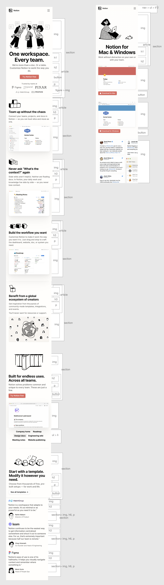

# Procesverslag

Markdown is een simpele manier om HTML te schrijven.  
Markdown cheat cheet: [Hulp bij het schrijven van Markdown](https://github.com/adam-p/markdown-here/wiki/Markdown-Cheatsheet).

Nb. De standaardstructuur en de spartaanse opmaak van de README.md zijn helemaal prima. Het gaat om de inhoud van je procesverslag. Besteedt de tijd voor pracht en praal aan je website.

Nb. Door _open_ toe te voegen aan een _details_ element kun je deze standaard open zetten. Fijn om dat steeds voor de relevante stuk(ken) te doen.

## Jij

  
uitwerken voor kick-off werkgroep

### Auteur:

Rose Mulazada

#### Je startniveau:

Rode piste

#### Je focus:

Responsive (eerst surface)

## Je website

  
uitwerken voor kick-off werkgroep

### Je opdracht:

www.notion.so/

#### Screenshot(s) van de eerste pagina (small screen):

Home  
 

#### Screenshot(s) van de tweede pagina (small screen):

Download for Mac & Windows

## Toegankelijkheidstest 1/2 (week 1)

  
uitwerken na test in 1e werkgroep

### Bevindingen

#### 1. Screenreader

Ik merkte gelijk dat sommige afbeeldingen niet worden opgelezen door de screenreader. Niet vanzelf, en ook niet met muis en toetsenbord. Ik heb er gelijk dus een puntje van gemaakt om ervoor te zorgen dat dit bij mij wel kan. Het blijkt dat er geen alt tekst staat bij de afbeeldingen en dat de rede is dat dit niet gebeurt. De website was voor de rest prima te navigeren.

#### 2. Muis en Toetsenbord

Hier korte omschrijving (met indien nodig afbeeldingen)
Zoals ik al heb gezegd werden foto's ook niet opgelezen met een muis en toetsenbord. Ook als ik erop probeerde te klikken deed dit niks. Ook worden de foto's voorgelezen voor de tekst wat niet heel fijn is voor mensen met een beperking. Belangrijke foto's worden ook niet opgelezen, denk bijvoorbeeld aan de 'trusted by' sectie waar er logo's staan van bedrijven die Notion gebruiken. Maar het wordt niet opgelezen.

#### Overig

De motoriek en visuele testen hadden we deze week niet gedaan.

## Breakdownschets (week 1)

  
uitwerken na afloop 2e werkgroep

### de hele pagina:

  

## Voortgang 1 (week 2)

  
uitwerken voor 1e voortgang

### Stand van zaken

hier dit ging goed & dit was lastig (neem ook screenshots op van delen van je website en code)

### Verslag van meeting

- Ik had wat moeite met de navigatie bar: het bleek eerst alsof je er niet doorheen kon met een screenreader op de standaard website. Hij opent het ook niet zelf, wat eigenlijk wel goed is. Maar ik kwam er toen achter hoe ik het kon openen, ik begreep de screenreader niet helemaal.
- Ik had verder niet heel veel vragen - het ging vooral over mijn figure, ik kreeg hem niet zoals de website omdat elke foto een andere grootte hadden.

## Voortgang 2 (week 3)

  
uitwerken voor 2e voortgang

### Stand van zaken

Ik besloot hier om te wisselen van surface naar responsive. Omdat ik opnieuw begonnen was had ik niet veel vragen te stellen aan de studentassistenten.

### Verslag van meeting

Uiteindelijk toen ik verder kwam met mijn website kwam ik bij een aantal delen met Javascript. Ik heb toen aan de docent gevraagd hoe het hiermee zat, en hij vertelde me onderanderen dat ik hidden attributes en on scroll kan gebruiken.

## Toegankelijkheidstest 2/2 (week 4)

  
uitwerken na test in 8e werkgroep

### Bevindingen

Lijst met je bevindingen die in de test naar voren kwamen (geef ook aan wat er verbeterd is):

#### Screenreader

Hier korte omschrijving (met indien nodig afbeeldingen)

Hier een omschrijving van hoe het opgelost kan worden (met indien nodig afbeeldingen)

#### Muis en Toetsenbord

Hier korte omschrijving (met indien nodig afbeeldingen)

Hier een omschrijving van hoe het opgelost kan worden (met indien nodig afbeeldingen)

#### Motoriek (shocks, elastiekjes)

Hier korte omschrijving (met indien nodig afbeeldingen)

Hier een omschrijving van hoe het opgelost kan worden (met indien nodig afbeeldingen)

#### Visueel (brillen, contrast, kleurenblind, dark/light).

Hier korte omschrijving (met indien nodig afbeeldingen)

Hier een omschrijving van hoe het opgelost kan worden (met indien nodig afbeeldingen)

## Voortgang 3 (week 4)

  
uitwerken voor 3e voortgang

### Stand van zaken

hier dit ging goed & dit was lastig (neem ook screenshots op van delen van je website en code)

### Agenda voor meeting

samen met je groepje opstellen

| student 1      | student 2          | student 3    | student 4        |
| -------------- | ------------------ | ------------ | ---------------- |
| dit bespreken  | en dit             | en ik dit    | en dan ik dat    |
| en dat ook nog | dit als er tijd is | nog een punt | dit wil ik zeker |
| ...            | ...                | ...          | ...              |

### Verslag van meeting

hier na afloop snel de uitkomsten van de meeting vastleggen

- punt 1
- punt 2
- nog een punt
- ...

## Eindgesprek (week 5)

  
uitwerken voor eindgesprek

### Je uitkomst - karakteristiek screenshots:

  

### Dit ging goed/Heb ik geleerd:

Korte omschrijving met plaatjes

  

### Dit was lastig/Is niet gelukt:

Korte omschrijving met plaatjes

  

## Bronnenlijst

  
continu bijhouden terwijl je werkt

Nb. Wees specifiek ('css-tricks' als bron is bijv. niet specifiek genoeg).

1. https://codepen.io/shooft/pen/dymRMBZ
2. bron 2
3. ...

